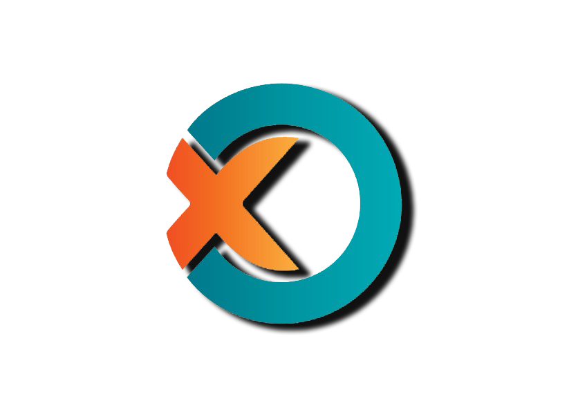

# **Client side of tic tac toe game**

**Server side repo :** https://github.com/Abdallah-Refay/TicTacToe-Server.git
  

# Key Featuers :- # 
* Global chat for all player
* Private in game chat
* Pasue and resume game any time 
* Three hardness levels of single player mode

 

## Dependencies ##
* **Gson :** Java library to serialize and deserialize Java objects to JSON

* **javaFX** 

